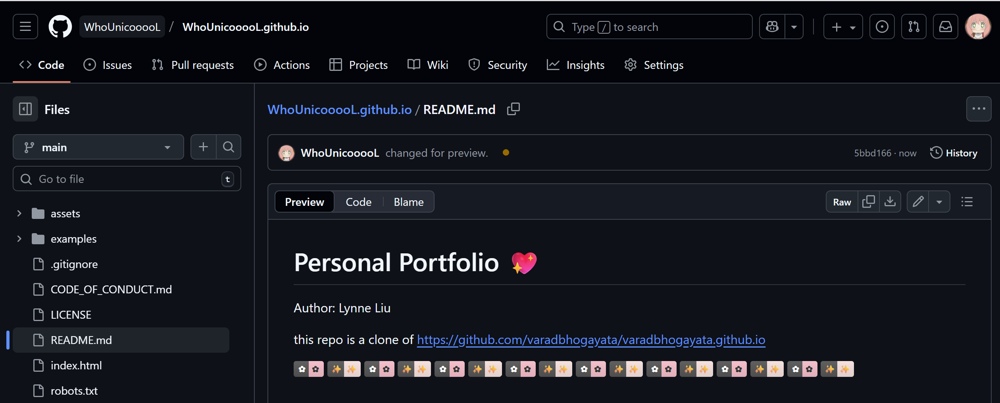
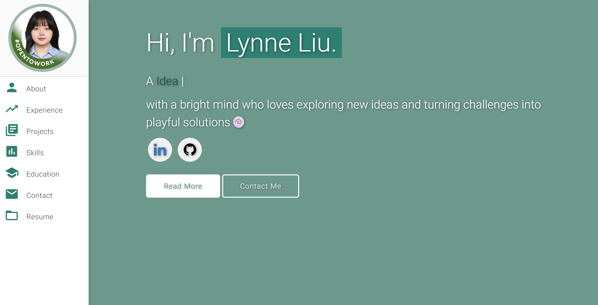
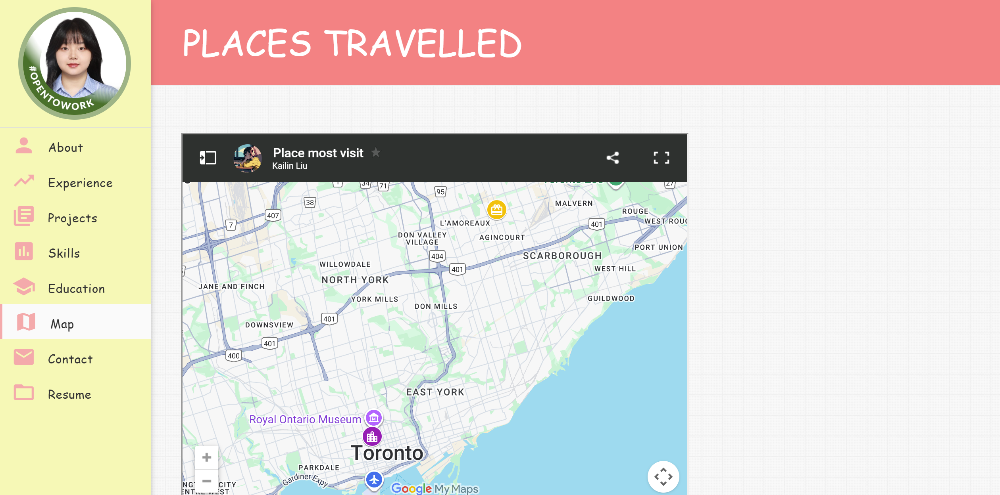
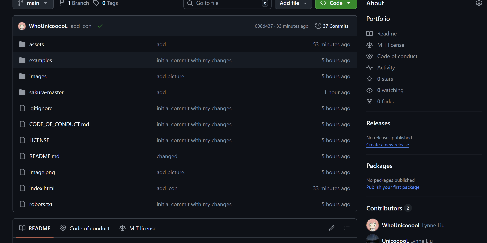
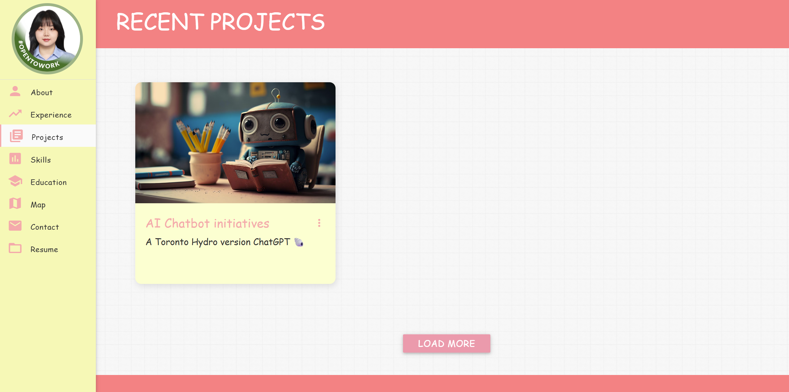
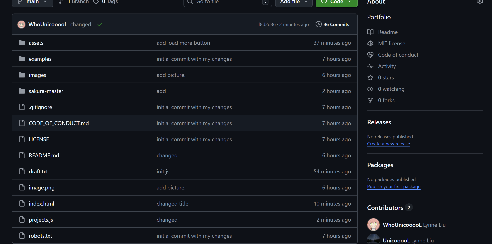

# Personal Portfolio 💖   
Author: Lynne Liu

this repo is a clone of
https://github.com/varadbhogayata/varadbhogayata.github.io

### Activity 1
  

### Activity 2 
  
 

### Activity 3
  
  

### Activity 4
  
  

### Activity 5
  
  

### Website Preview

 
  <kbd>
    
  </kbd>

## Sections 📚
✔️ About me\
✔️ Experience\
✔️ Projects \
✔️ Skills \
✔️ Education\
✔️ Contact Info\
✔️ Resume

To view a live example, **[click here](https://whounicooool.github.io/)**

## Tools Used 🛠️
* [<b>GitHub Pages</b>](https://create-react-app.dev/docs/deployment/#github-pages) - To host my static website (HTML, CSS, JS).
* [<b>Materialize</b>](https://materializecss.com/) - A CSS framework to get Google's Material Design components.
* [<b>Typed.js</b>](https://mattboldt.com/demos/typed-js/) - JavaScript Library

## License 📄
This project is licensed under the MIT License - see the [LICENSE.md](./LICENSE) file for details.
